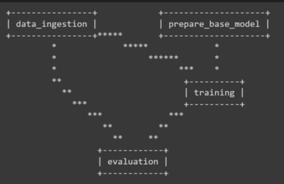
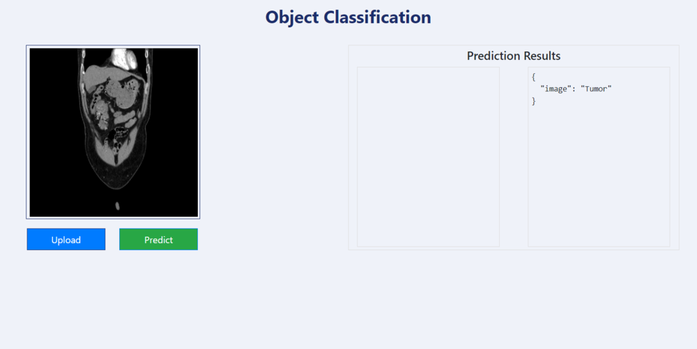

<!-- PROJECT LOGO -->
<br />
<p align="center">
  <h1 align="center"> End-to-End-Kidney-Disease-detection-pipeline</h1>

  <p align="center">
  </p>
</p>


## About The Project
This project exemplifies the end-to-end development of a deep learning project focused on image classification for Kidney tumor detection in CT Scan images. It encompasses all MLOps best practices, encompassing data preparation, model training, evaluation, and the implementation of model monitoring pipelines. MLFlow is employed for rigorous model experimentation and evaluation, while DVC (Data Version Control) is implemented for facilitating effective pipeline tracking.

## Getting Started
- Clone the repository
```bash
git clone https://github.com/imlokesha/Kidney-Disease-detection.git
```
- Create conda environment after opening the repository
```
conda create -n kidney-classifier python=3.8 -y
```
```
conda activate kidney-classifier
```
- Install the dependencies
```
pip install -r requirements.txt
```
## Data Sources and Model details
The dataset consist of kidney CT scan images with labels for each image as "tumor" or "normal". The dataset can be found [here](https://www.kaggle.com/datasets/anima890/kidney-ct-scan).
### Model details
We have used a VGG16 CNN model for image classification of the ct scan images. The model architecture is demonstrated below. Know more about VGG16 [here](https://keras.io/api/applications/vgg/). 

## Pipelines 
- Run all the pipelines through main.py file
```
python main.py
```
- <b>Data Ingestion:</b> For downloading all the image dataset into local environment. Run the below command to run this pipeline.
```
python src/cnnClassifier/pipeline/stage_01_data_ingestion.py
```
- <b>Base model preparation pipeline:</b> Too load the base model of VGG16 and save the modified model file.
```
python src/cnnClassifier/pipeline/stage_02_prepare_base_model.py
```
- <b>Model Training:</b> For training the model. The model parameters can be viewed and changed in params.yml
```
python src/cnnClassifier/pipeline/stage_03_model_training.py
```
- <b>Model Evaluation:</b> For calculation the model evaluation metrics. Run the below command after setting up the MLFlow.
```
python src/cnnClassifier/pipeline/stage_04_model_evaluation.py
```
## Setup MLFlow and DagsHub
- Import the github repo on DagsHub. Know more about this [here](https://dagshub.com/docs/integration_guide/github/).
- Export the MLFlow variables as environment variables. Run the below command by adding below credentials.
```bash
export MLFLOW_TRACKING_URI=

export MLFLOW_TRACKING_USERNAME=

export MLFLOW_TRACKING_PASSWORD=
```
After setting MLFlow visit the tracking URI to see the model experimentation results and model evaluation scores. 

## Track and run the pipeline through DVC
- Initiate DVC
```bash
dvc init
```
- Run the entire pipeline through DVC. The pipeline status can be tracked in terminal after running the below command. 
```bash
dvc repro
```
- Track the pipeline through dvc. The below image shows the pipeline dependencies. 
```bash
dvc dag 
```



## Flask Web app for prediction
- To launch the flask app, run the below command.
```bash
python app.py
```
- After this copy the port link from the terminal to the browser.
<br>
Below the demo of the flask prediction web app.
<br>

